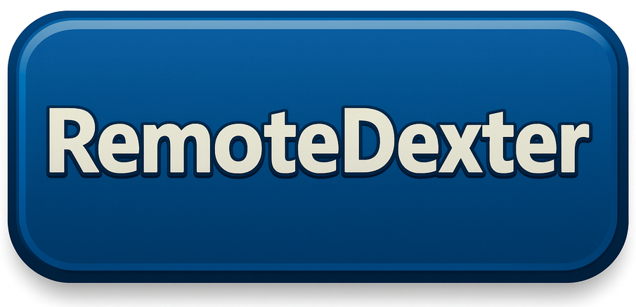

  

# RemoteDexter (RD)

RemoteDexter (RD) is a user-owned, peer-to-peer remote access tool. It is designed so users can inspect the source, verify the architecture, and confirm that the system does not call home or depend on any third-party infrastructure.

## Open Source Trust Launch scope
This repository is the public, auditable baseline for RD. Users and auditors should be able to verify:
- No hardcoded servers, domains, or IPs
- No telemetry, analytics, or tracking
- No auto-update or hidden network calls
- No silent pairing or installs
- All connections are user-initiated and user-owned

## Repository layout
- /src contains RD Desktop Application and RD Mobile Application source code
- /docs contains architecture, bootstrap flows, and threat model documentation
- SECURITY.md, SOVEREIGNTY.md, and VERIFYING_RD.md document the trust model

## Install (high-level)
1. Build the RD Desktop Application from source for the User PC.
2. Build the RD Mobile Application from source for the User Device.
3. Use a Bootstrap Channel (Bluetooth, AirDrop, or USB) for first-time installation or pairing.
4. Connect the User Device directly to the User PC.

See BUILD.md for detailed build instructions.

## Security and verification
- SECURITY.md covers security posture, guarantees, and the threat model.
- SOVEREIGNTY.md explains user-owned endpoints and no call-home design.
- VERIFYING_RD.md includes a verification checklist and LLM prompts.

## Future model and closure transparency
FUTURE_MODEL.md explains how any future closed-source components will be layered on top of a known-good audited base without adding hidden behavior.

## Community and reporting
Independent reviews and security audits are welcome. Report vulnerabilities using the process in SECURITY.md.